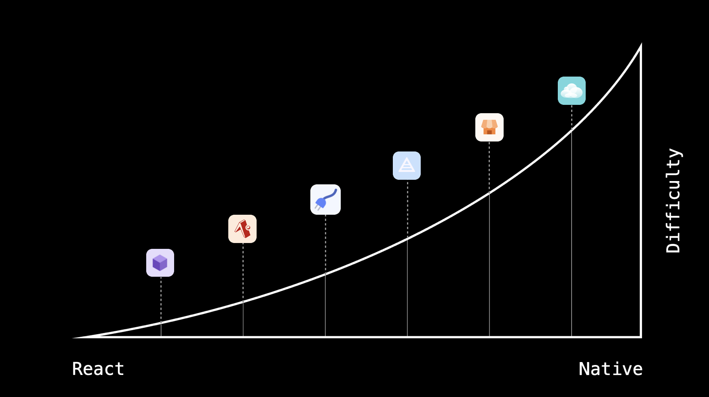

# Notes

There are a variety of ways to start a React Native project. The best way to get started is to start small and fast, then grow into a more complex project over time.



## Bootstrap

Create a JS project.

```
npx create-expo-app
```

or

```
yarn create expo-app
```

> If you've heard about React Native before, you've probably seen `expo init`, create-expo-app replaces `expo init`.

## Running in a Sandbox

You can run this app without having to do a native build by installing the "Expo Go" app on your phone or simulator, this is the fastest way to get started with native development.

## TypeScript

It's generally much nicer to use a typing system when developing, you can add TypeScript to an Expo project by either converting a file extension from `.js` to `.ts`, or by creating a blank tsconfig with `touch tsconfig.json`, then simply run `expo start`, this will automatically setup everything you need to use TypeScript in Expo.

> Docs [Expo: TypeScript](https://docs.expo.dev/guides/typescript/)

## Native Code

By default, Expo "manages" the native code in your project. You configure how the native apps will be generated (`expo prebuild`) via the `app.json` config file.

Think of this like Node modules where the `ios/android` folders are your `node_modules` folder, the `app.json` is your `package.json`, and `expo prebuild` is your `npm install`. This formula is great for upgrading between versions of React Native, and adding complex functionality to your app since the prebuild process is well tested.

When you `expo prebuild` on an Expo project, it can be treated exactly the same as a React/Native app, you can use it with any native tooling.

Alternatively, just like with node modules, you can jump in to your `ios/android` generated folders and modify them directly, but this means you can no longer run `expo prebuild` safely without potentially overwriting your local changes -- we refer to this process as "bare workflow".

Both the managed and bare workflows offer custom native code. Bare is a bit more hands-on and requires a deep understanding of native platforms, whereas managed moves a bit slower (since it's an abstraction).

Regardless, there's no lock-in, you can change from managed to bare by running `expo prebuild`, and you can move from bare back to managed by deleting your ios/android folders.

### Dev Clients

When you add custom managed code, you may want to install the expo-dev-client package. `expo-dev-client` adds extra dev tooling to your React Native app, enabling you to switch between apps and connect to dev servers more easily.

`expo-dev-client` is automatically removed from production builds.

You can create dev client builds locally with `expo run:android` and `expo run:ios` -- you can also build in the cloud using `eas build` from `npm i -g eas-cli`.

## Troubleshooting

- You might have to use `sudo` on `yarn start` to get web working. The server creates an SSL connection so that you can access certain web APIs that require a secure connection.
- If you're having other errors, see [common development errors](https://docs.expo.io/workflow/common-development-errors/).
- Learn how to set up an [Android simulator](https://docs.expo.io/workflow/android-studio-emulator/).
- You may also need/want to download the Expo Client app on your phone and run it as your development device. (You must create an Expo account and log into it on both your computer and your device).
  - iOS app: https://itunes.apple.com/app/apple-store/id982107779
  - Androind app: https://play.google.com/store/apps/details?id=host.exp.exponent
