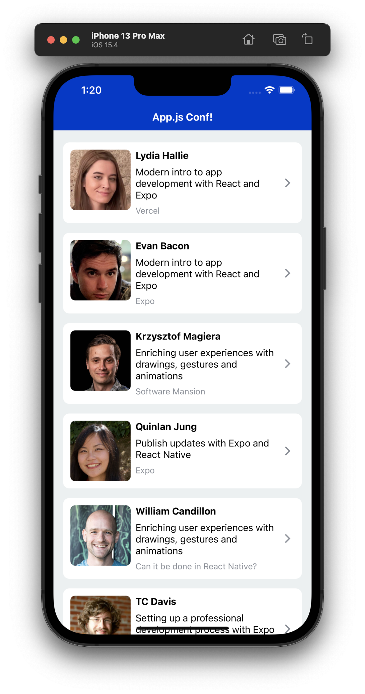
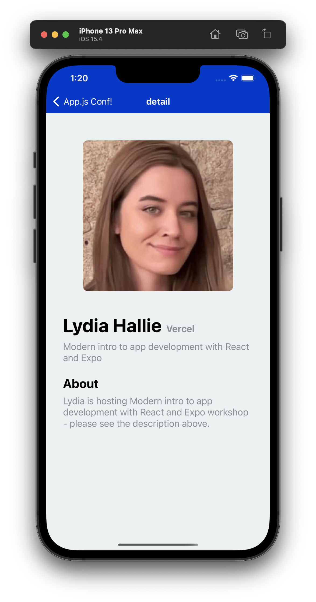

# Notes

- We've added some extra boilerplate components which can skip over, the purpose of this exercise is to focus on navigation around complex UI.

- [React Navigation: Parameters](https://reactnavigation.org/docs/params)

