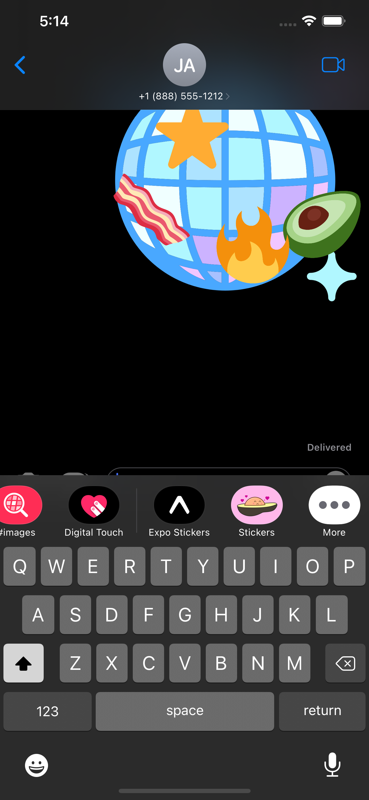
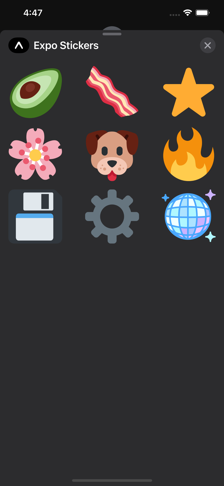

# iMessage Stickers Example

1. Utilizing the `@config-plugins/ios-stickers` config plugin we'll generate an iMessage sticker app. [API Reference](https://github.com/expo/config-plugins/tree/main/packages/ios-stickers).
2. Install the plugin `yarn add @config-plugins/ios-stickers`
3. Add to the `plugins` array of the `app.json`
4. Add a `name` property for the config plugin.
5. Add an icon that will show up in the iMessage app switcher using the `icon` property. Set it to the `sticker-icon.png` local file.
6. We'll use a basic icon endpoint to generate our images for us: [example](https://icogen.vercel.app/api/icon?color_hex=00000000&padding=0&icon=🥑). Add a list of stickers to the `stickers` array inside of our plugin.
7. You can also set the `columns` number to a value between 2-4.
8. Prebuild the project with `expo prebuild -p ios --no-install`
9. Build the project with `expo run:ios` and open the iMessage app to find the stickers app.

